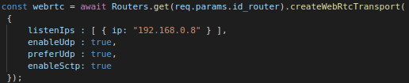
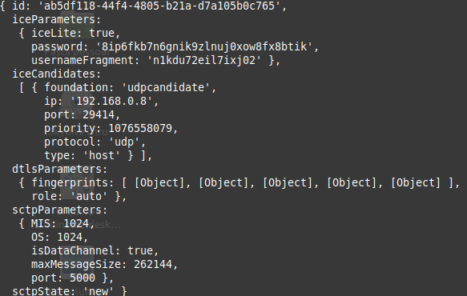
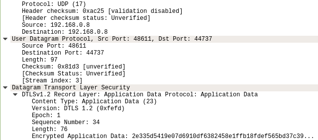

# SFU_Webrtc_server
## Resumo
  O projeto proposto busca fornecer um serviço de infraestrutura para jogos multi usuários em tempo real, visando baixa latência. Para isso alguns serviços e tecnologias já existentes serão utilizadas e integradas de forma a entregar a solução. A ideia final é tornar o serviço genérico para qualquer tipo de jogo da categoria, rodando em segundo plano. Para o presente trabalho, foi utilizado um jogo implementado com uma biblioteca para desenvolvimento de jogos em 2D, o Phaser. O jogo se trata de dois personagens que percorrem o mapa em caça de estrelas espalhadas pelo cenário. Ao coletar todas o jogo tem seu fim e é dado um vencedor.

## Infraestrutura
  Por se tratar de um jogo, o serviço responsável pelo roteamento de dados deve ser confiável e ágil, de modo a garantir uma latência imperceptível ao usuário. Dessa forma foi escolhida uma técnica de roteamento de dados conhecida por SFU (Selective Forwarding Unit). A SFU é uma poderosa unidade responsável por reconhecer todos os usuários inseridos na aplicação, receber múltiplas stream de dados  e decidir o seu destino. Entre diversas bibliotecas que disponibilizam um servidor SFU, a escolhida foi a MediaSoup.
  
  O MediaSoup é uma biblioteca em Javascript que implementa funções para transporte de Video, Audio e Data Channels. Uma vez que a escolha para o projeto é um servidor que realiza somente o transporte de dados de teclado e mouse do computador, o foco deste documento adiante será apenas para Data Channel.

 Sendo assim, cria-se um subprocesso no servidor instânciando a classe Worker. Dentro de um Worker pode-se criar diversos Router, que nada mais são que os responsáveis por realizar o roteamentos das midias para os demais endpoints. Diferente dos videos e áudios que utilizam RTP, o transporte dos Data Channels pelo MediaSoup será sobre SCTP (Stream Control Transmission Protocol), implementando duas classes: Producer, que encaminha Data Channels para o router SFU e o Consumer, responsável por encaminhar um Data Channel para um endpoint. A arquitetura dessas duas classes são semelhantes a técnica Publish-Subscriber e ambas são intânciadas no lado servidor e cliente. Um cliente A, para receber dados do cliente B, deve inscrever seu Consumer com o id do Producer do cliente A.
 
Ambos tem a capacidade de comunicar com o servidor e serem notificados do status do outro cliente. Sendo assim, todas as configurações necessárias para o correto funcionamento do MediaSoup é realizada até o momento que ambos clientes são notificados que estão preparados para iniciar o jogo. Além disso, o servidor informa ao cliente que acabou de entrar se o mesmo é o jogador 1 ou 2 (isso é necessário para a definição da posição inicial do personagem ao iniciar o jogo).  

## Sinalização
A sinalização entre servidor e cliente do Phaser é feita através de websocket e suas tags foram criadas manualmente. Já a comunicação entre servidor Phaser e servidor MediaSoup é realizada através de requisições HTTP. Toda a implementação foi projetada para atender apenas dois usuários. Vale ressaltar que a sinalização serve para comunicação do jogo e também para estabelecer a conexão dos usuários com o servidor MediaSoup.
### Tag "req_transport"
A tag "req_transport" notifica o servidor da sua entrada no jogo e requisita as midias, bem como instância o WebRtcTransport, responsável pela criação dos canais de transporte no mediasoup-client para transmissão e recepção dos data channels. Internamente, o transporte mantém uma instância do WebRTC RTCPeerConnection. A chamada é feita através de uma chamada HTTP no mediasoup server com uri "/router/(id do router)/webrtc_transport/create". O servidor responde a requisição através da tag "res_transport"

### Tag "res_transport"
Nesta etapa é que acontece a oferta de midia do MediaSoup. Ao receber as instâncias do objeto WebRtcTransport os parâmetros ofertados pelo servidos são enviados para o cliente, bastando apenas criar as instâncias no lado cliente e conectar o transporte. Devido ao seu design, o mediasoup-client requer transportes WebRTC separados para envio e recebimento. Sendo assim é recebido como resposta da chamada "req_transport" as ofertas de midia do transporte Webrtc (Nesse ponto ainda não foi  definido qual recebe e qual envia, entretanto já é definido os atributos "send" e "recv" para facilitar na programação). 

* send: Parâmetro com a oferta do transporte de envio
* recv: Parâmetro com a oferta do transporte de recepção

Em seguida é definido a direção do transporte Webrtc com as chamadas createSendTransport(options) e createRecvTransport(options), ambos recebem as mídias ofertadas. 

### Tag "producedata"
Estabelecida conexão, o lado cliente requisita a criação da instância Producer, citada anteriormente. Criada essa instância nos dois lados, o jogo está pronto para começar. Dessa forma o producedata espera os seguintes parâmetros Sctp:

SctpParameters: 
  * port - Porta para comunicação 
  * OS - Define a quantidade de stream que irão dar saída do terminal para o Router
  * MIS - Define a quantidade de stream que irão dar entrada no terminal
  * maxMessageSize - Tamanho máximo das messagens

### Tag "req_dataconsumer
Chamada para a criação do Consumer, realizando o subscriber no Producer do outro player. O servidor responder o cliente com a tag "res_dataconsumer". O req_dataconsumer espera os seguintes parâmetros:

* dataProducerId - ID do producer que vai se increver para receber mensagens
* sctpStreamParameters - Parâmetros do SCTP 
  

## Negociação de mídia

A negociação de midia acontece na criação do transporte WebRtc. Um transporte WebRTC representa um caminho de rede negociado por ambos via procedimentos ICE e DTLS. Um transporte WebRTC pode ser usado para receber mídia, enviar mídia ou para receber e enviar. Não há limitação no mediasoup. Ao chamar Router.createWebRtcTransport() definem-se os parâmetros que serão ofertados através de atributos, tais como:
* listenIps - Endereço IP de hospedagem do servidor
* enableUdp - Ofertar protocolo Udp
* enableTcp - Ofertar protocolo Tcp
* preferUdp - Dá preferência de escolha do protocolo Udp na oferta da midia.
* enableSctp - Ofertar protocolo Sctp
  
Como estamos lidando com dataChannels, podemos ver no exemplo a seguir que no servidor foi dada prefêrencia ao uso do protocolo udp para transporte: 
  

  
Com isso, temos as midias ofertadas:
 

  
Para conexão, ao realizar a chamada createSendTransport() ou createRecvTransport() no lado cliente é criada uma escuta aguardando a chamada do servidor do reconhecimento da definição da midia escolhida e é enviada uma chave dtls para autenticação e estabelecimento do transporte. A chamada webRtcTransport.connect({ dtlsParameters }) no lado servidor recebe a chave dtls responsável por prôver o transporte WebRtc com os clientes. Na imagem a seguir uma exemplo de uma chave dtls entregue para conexão:

Em uma busca rápida no Wireshark nota-se o uso do protocolo Udp para transporte e DTLS sobre TLS.

Outra captura interessante é a resposta do Binding Request feita pelo servidor STUN. A implementação de transporte WebRTC do mediasoup é o ICE Lite, o que significa que ele não inicia as conexões do ICE, mas espera as ICE Binding Request a partir dos terminais clientes.

  
 ## Instalando módulos e pacotes
 1. git clone https://github.com/nelsonealves/SFU_Webrtc_server.git
 2. cd SFU_Webrtc_server
 3. ./install.sh
 4. ./run.sh
 5. Abra o navegador e acesse http://(ip do servidor):3000  

 
 

